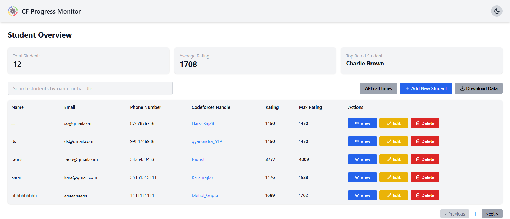

# CF Progress Management - Project Documentation

A full-featured MERN (MongoDB, Express.js, React.js, Node.js) stack application with Tailwind CSS to track and visualize Codeforces progress of students.

---

## Table of Contents
- [Overview](#overview)
- [Tech Stack](#tech-stack)
- [Features](#features)
  - [Student Table View](#student-table-view)
  - [Student Profile View](#student-profile-view)
  - [Codeforces Data Sync](#codeforces-data-sync)
  - [Inactivity Detection](#inactivity-detection)
- [Installation](#installation)
- [Screenshots](#screenshots)
- [Additional Notes](#additional-notes)

---

## Overview
This application helps administrators track competitive programming progress for enrolled students via Codeforces. It stores and displays metrics like rating, contest history, and problem-solving activity, including detailed visualizations. A backend cron job keeps data updated and reminders are sent to inactive students.

---

## Tech Stack
- **Frontend:** React.js, Tailwind CSS
- **Backend:** Node.js, Express.js
- **Database:** MongoDB (via Mongoose)
- **Other Tools:** Nodemailer, node-cron, Recharts

---

## Features

### Student Table View
- Display table of all students:
  - Name, Email, Phone Number, Codeforces Handle, Current Rating, Max Rating
- Actions per row:
  - **Edit** student info
  - **Delete** student
  - **View Details** (navigate to profile)
- Global actions:
  - **Add Student**
  - **Download CSV**
- Shows "Last Updated" timestamp from the latest Codeforces sync

### Student Profile View
- Split into two sections:
  1. **Contest History**
     - Filter by last 30, 90, 365 days
     - Shows: rating graph, contest list with rating changes, ranks, unsolved problems
  2. **Problem Solving Data**
     - Filter by last 7, 30, 90 days
     - Shows:

       - Most difficult problem solved (by rating)

       - Total problems solved

       - Average rating

       - Average problems per day

       - Bar chart (problems solved per rating bucket)

       - Submission heatmap

### Codeforces Data Sync
- Automatically fetches Codeforces data every day at 2 AM using cron job
- Avoids real-time API calls during the day for performance
- On CF handle update, data is fetched immediately


---

## Installation

```bash
# Clone the repo
git clone https://github.com/yourusername/CF_Progress_Management.git
cd CF_Progress_Management

# Set up frontend
cd frontend
npm install
npm run dev

# Set up backend
cd ../server
npm install
npx nodemon .\server.js 
```

Set up your `.env` files as needed for MongoDB

---

## Screenshots

_You can add screenshots here using markdown:_

```md


```

---

## Additional Notes
- Fully responsive for mobile/tablet
- Light/Dark mode toggle implemented
- Code is modular, clean, and well documented

## ✅ Remaining Tasks

- Set up multiple cron jobs to fetch Codeforces data at staggered times.  
- Detect students with no submissions in the last 7 days after each sync.  
- Send automated email reminders to inactive students using Nodemailer.  
- Track the number of reminder emails sent to each student.  
- Allow disabling reminder emails per student via a toggle option.
